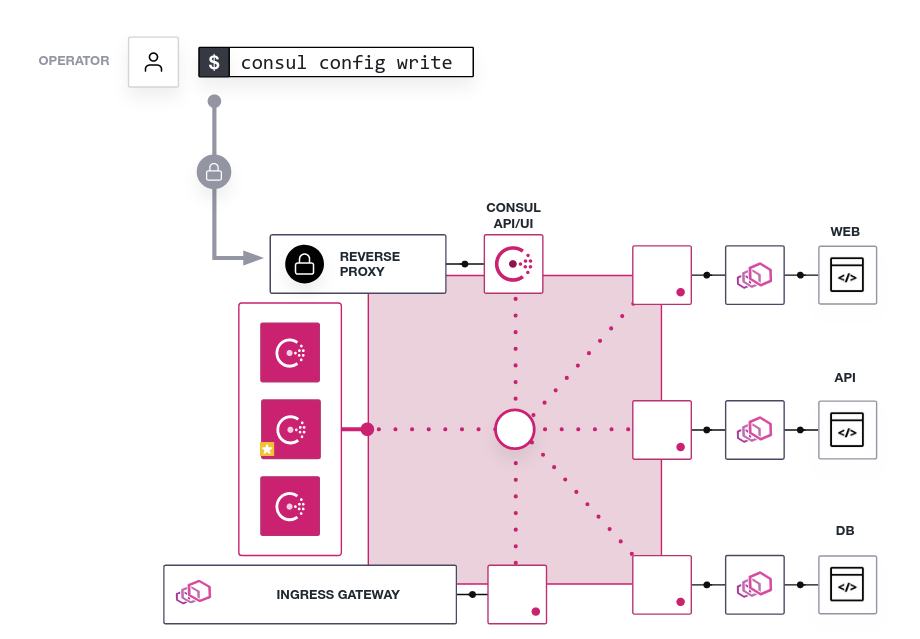

# Consul Sandbox Scenario

The script `local-provision.sh` will provision a Consul service mesh sandbox
environment locally using Docker containers to simulate VM-like nodes.

> **NOTE:** The script name will be changed once fully integrated with katacoda. 

## Requirements

The script requires:
* Docker installed on your machine
* Consul binary (same version of the one ran by the sandbox), 
if the binary is not present in your machine it will install it in the `./bin` directory.

## Usage

### Startup

```shell
./local-provision.sh
```

The command will provision the following set of containers:

| Container name | Container IP * | Description |
|----------------|:--------------:|-------------|
| server-1       | 172.17.0.2     | Consul server 1 | 
| server-2       | 172.17.0.3     | Consul server 2 | 
| server-3       | 172.17.0.4     | Consul server 3 |
| load-balancer  | 172.17.0.5     | Used to access Consul UI/API over HTTPS |
| web            | 172.17.0.8     | Application Web interface |
| api            | 172.17.0.7     | Application API tier |
| db             | 172.17.0.6     | Application DB backend |
| ingress-gw     | 172.17.0.9     | Expose `web` service outside the mesh |

Here a visual example of the architecture created by the script:



### Show Exposed Ports

```shell
./local-provision.sh ports
```

Expected OUtput:

```plaintext
...

=======================
server-1 - 172.17.0.2
=======================
tcp        0      0 127.0.0.1:8500          0.0.0.0:*               LISTEN      6/consul
tcp        0      0 127.0.0.1:53            0.0.0.0:*               LISTEN      6/consul
tcp        0      0 127.0.0.1:8502          0.0.0.0:*               LISTEN      6/consul
tcp        0      0 :::8300                 :::*                    LISTEN      6/consul
tcp        0      0 :::8301                 :::*                    LISTEN      6/consul
tcp        0      0 :::8302                 :::*                    LISTEN      6/consul

...
```

### Clean

```shell
./local-provision.sh
```

## Default Configuration

| Configuration | Tunable | Default Value |
|---------------|:-------:|---------------|
| SERVER_NUMBER | YES     | 3 |
| Docker Image  | YES     | [Docker Hub link][docker-image-link] |
| DATACENTER    | YES     | sandbox |
| DOMAIN        | YES     | consul  |

## Tune Configuration

**SERVER_NUMBER**, **DATACENTER**, **DOMAIN**: 
You can change the variable in the script to modify the number of servers being created.

**Docker Image**: 
For the sandbox we used a Docker container to simulate a VM-like scenario. 
The Docker image was built starting from `envoyproxy/envoy-alpine` to
provide the Envoy proxy and Consul binary was added alongside with a go
application (`/usr/local/bin/fake-service`) that is used to simulate a
three-tier application scenario.

The IMAGE_TAG follows the pattern `v<consul-version>-v<envoy-version>`
Not all combinations are fully supported by Consul. Refer to 
https://www.consul.io/docs/connect/proxies/envoy#supported-versions
to make sure you are using a version that is fully compatible.


[docker-image-link]:https://hub.docker.com/repository/docker/danielehc/consul-learn-image