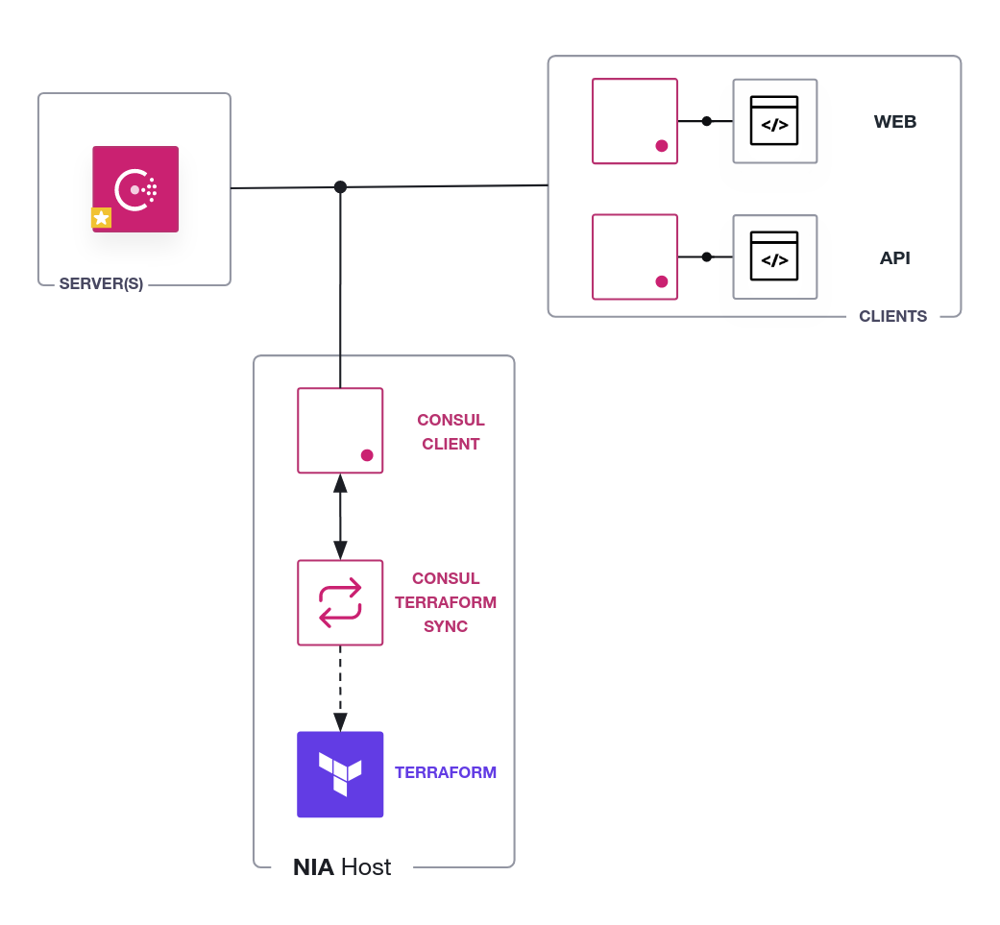

# Network Interface Automation with Consul-Terraform-Sync

In this hands-on lab, you will deploy a Consul datacenter using Docker,
install Consul-Terraform-Sync, and use it to monitor changes in the service
catalog.

Specifically, you will:

- 